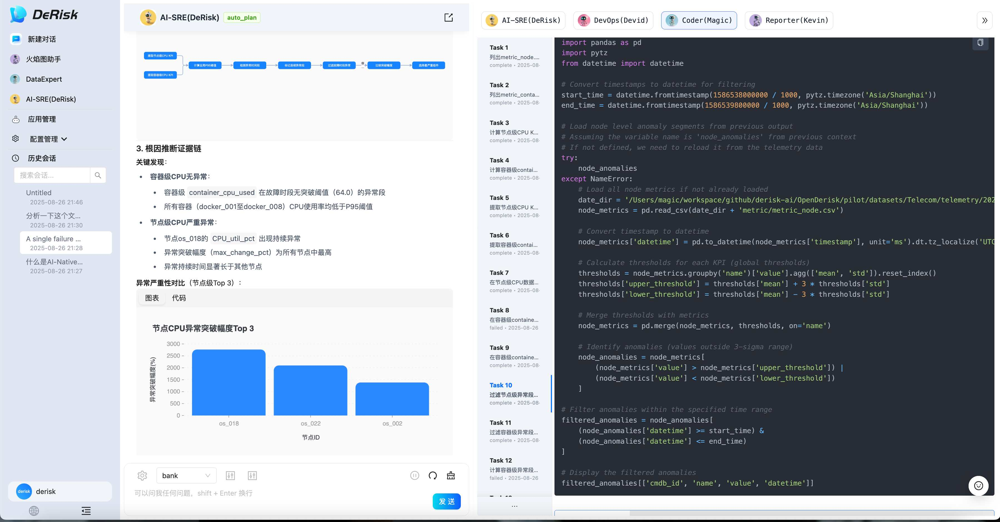
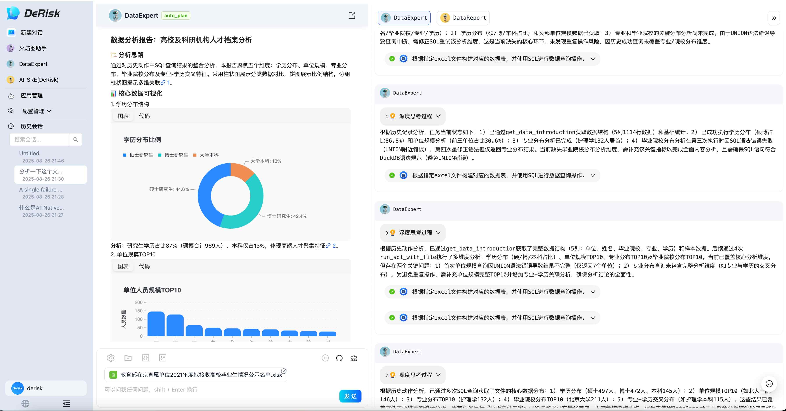
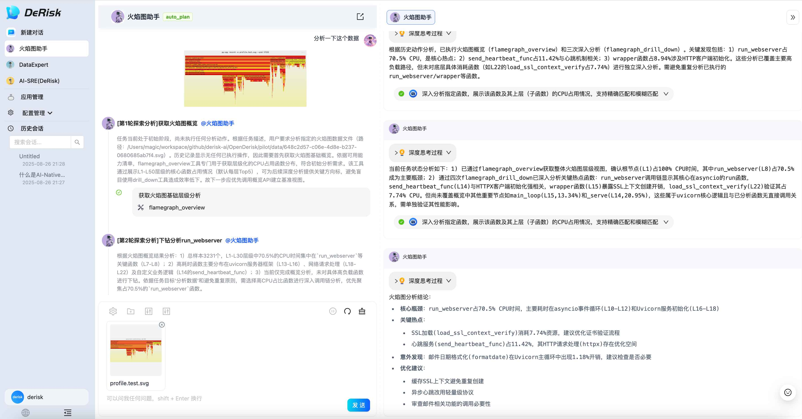
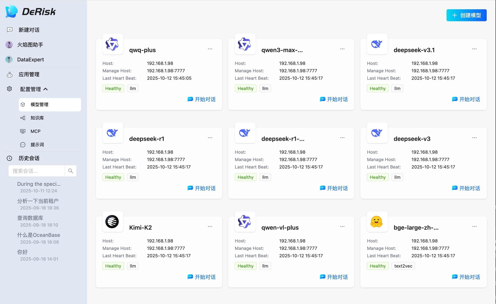
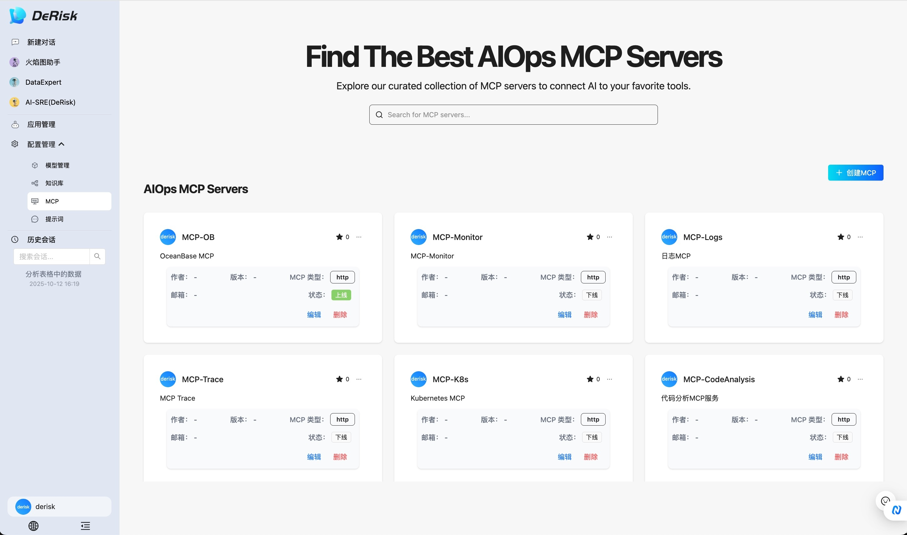
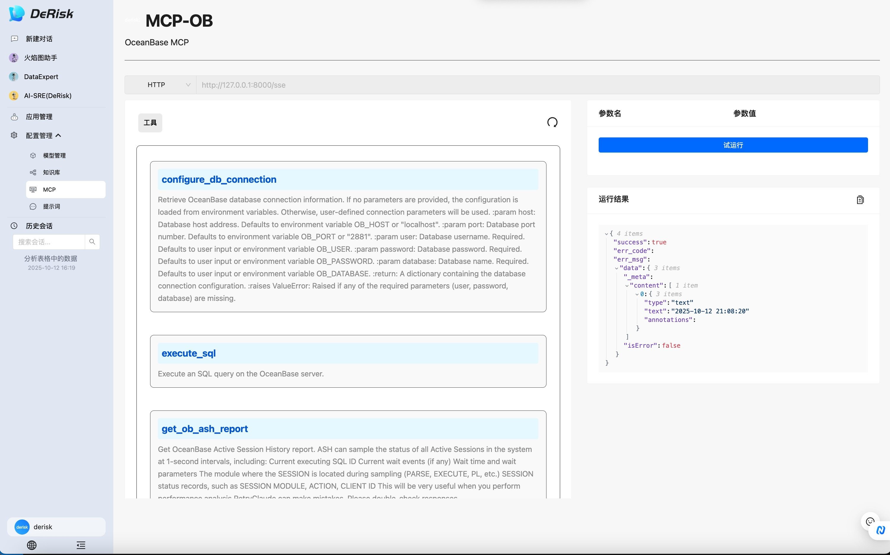
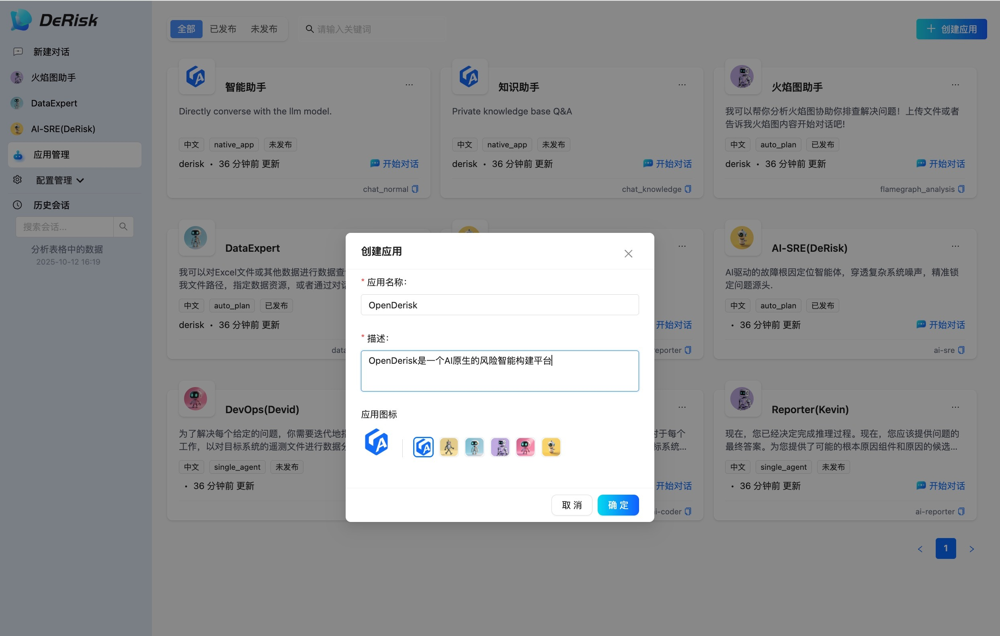
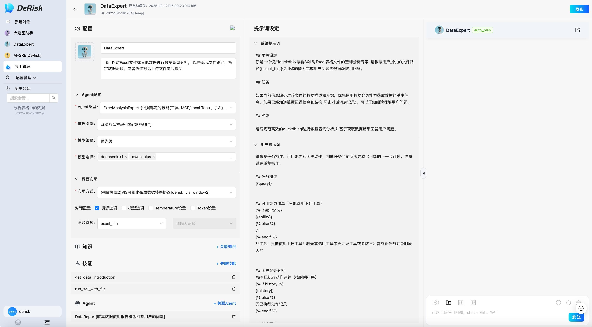

# OpenDerisk V0.2版本更新

OpenDerisk V0.2版本, 构建面向未来的Multi-Agent开发与运行产品框架，主要包含以为核心能力:
## 1. 多智能体构建框架，主要功能包括
- 提示词编写
    - 系统提示词编写
    - 用户提示词编写
- Context资源编排
- 模型配置
    - 模型选择
    - 参数调优
- 技能配置(工具/MCP)
    - 本地工具集成
    - MCP协议支持
- 知识
    - 知识库管理
    - 检索配置
- 记忆
- 调试预览

## 2. 运行态，构建多智能体运行的标准范式

- Agent的本质是做价值交付，所以运行态的主界面需要围绕价值交付来设计，并展示交付结果的达成路径(规划路径)
    - Agent的核心价值是做结果交付，所以Agent运行的主路径，是可以从一个Query交付结果。

    - 在人与Agent协作的过程中，人需要去看Agent交付结果的达成路径，也就是大概的执行轨迹。

- 工作空间做过程展示与任务运行实时动态。当然面向未来，Agent的工作空间会随着任务状态的复杂性，变得越来越复杂、丰富。包括以后代码执行环境、多模态等。


- 工作空间内容的思考
随着Context Engineering的重要性越来越被更多的人共识，对上下文的管理、展示、调优的诉求也越来越多。
    - 工作空间承载Agent工作过程的展示，同时也是人与Agent交互过程中，快速判断Agent交付结果时，执行过程是否可靠、准确的最直接依据。因此工作空间的内容，需要足够表达工作过程的核心环节，便于人做直观的判断。 

## 3. 首页升级
面向AI-Native的首页升级
### 场景
1. 故障诊断专家 AI-SRE
<p align="left">
  
</p>
2. 数据分析专家 DataExpert
<p align="left">
  
</p>
3. 火焰图助手
<p align="left">
  
</p>

## 使用说明
使用方面主要介绍一下基础模块以及默认内置场景的使用，同时针对V0.2的多智能体构建也做一个详细的使用介绍。 

### 1. 基础模块使用
OpenDerisk V0.2 提供了如下几个基础模块, 分别为:
- 模型管理
- 知识库
- MCP
- 提示词
这些基础模块都放在【配置管理】菜单栏下面。 

1. 模型管理
模型管理界面可以对模型进行管理，包括基本的增、删、改、查等操作。

<p align="left">
  
</p>

2. 知识库
知识库模块可以进行知识管理, 并内置了RAG检索的整套能力。

3. MCP
MCP模块可以进行MCP的管理, 包括增、删、改、查调试等, 目前不支持MCP的直接部署，只提供已部署好的MCP服务的管理。 


MCP管理
<p align="left">
  
</p>

MCP工具调试
<p align="left">
  
</p>


4. 提示词
提示词模块提供了一个统一的提示词编写与管理的界面。

### 2. 内置场景使用
* AI-SRE(OpenRca根因定位)
  -  !注意, 我们默认使用OpenRCA数据集中的[Bank数据集](https://drive.usercontent.google.com/download?id=1enBrdPT3wLG94ITGbSOwUFg9fkLR-16R&export=download&confirm=t&uuid=42621058-41af-45bf-88a6-64c00bfd2f2e),
  -  你可以通过链接, 或者下述命令进行下载：
    ```
      gdown https://drive.google.com/uc?id=1enBrdPT3wLG94ITGbSOwUFg9fkLR-16R
    ```
  - 下载完成后, 将数据解压到 ${derisk项目}/pilot/datasets。

* 火焰图助手
  - 使用你本地应用服务进程的火焰图(java/python)上传给助手提问分析

* DataExpert
  - 上传你的指标、日志、trace等各种Excel表格数据进行对话分析

### 3. 多智能体构建
在OpenDerisk V0.2版本, 一个重要的功能是提供了多智能体的构建与调试能力。打开左侧菜单栏的【应用管理】界面, 即可开始智能体的构建与管理。 

<p align="left">
  
</p>

点击打开智能体, 即可进行智能体的编辑配置, 如下图所示, 智能体编辑界面分为三栏, 分别为配置、提示词编写、调试预览。 

在配置栏, 可以配置智能体, 包括推理引擎配置、模型配置、智能体关联技能配置、知识配置、子智能体绑定等功能。

<p align="left">
  
</p>

#### 推理引擎配置
OpenDerisk在智能体执行时提供了多种推理模式，
1. 默认的基于ReACT的推理
2. 有基于Summary的推理
3. 基于RAG深度检索的推理
4. 基于上下文工程的推理
在实际使用中可以按照具体的场景进行选择。 推理引擎依赖大模型的能力, 所以在模型配置上也提供了多种调用策略。其中优先级策略下，配置多个模型之后，如果前面的模型不可用，会根据优先级依次调用。 

#### 界面布局
在OpenDerisk的设计中，每一类智能体都会有特定的工作空间，可以通过界面布局来选择不同智能体的工作空间。OpenDerisk内置了几种常见的工作空间的展示，在实际的使用中也可以自行拓展。  

#### 知识配置
配置智能体工作过程中依赖的背景知识。

#### 技能配置
关联智能体工作过程中依赖的技能，包括本地工具与MCP工具等。 

#### 智能体配置
绑定子智能体，实现多智能体协同处理复杂问题。


## 小结
OpenDerisk V0.2是围绕Multi-Agent构建的一套体系化的产品框架，可以支持复杂风险场景与智能防线的构建，我们期望通过OpenDerisk的开放性，促进风险智能领域的发展。 
